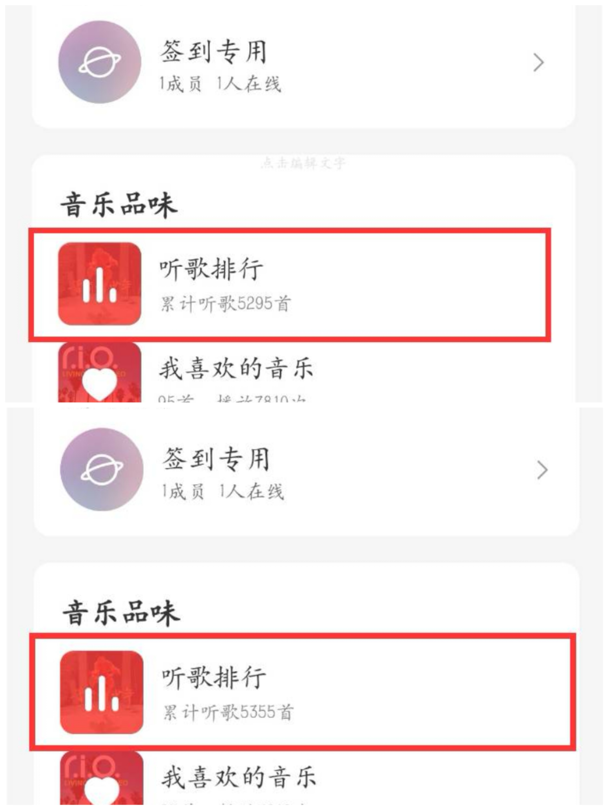
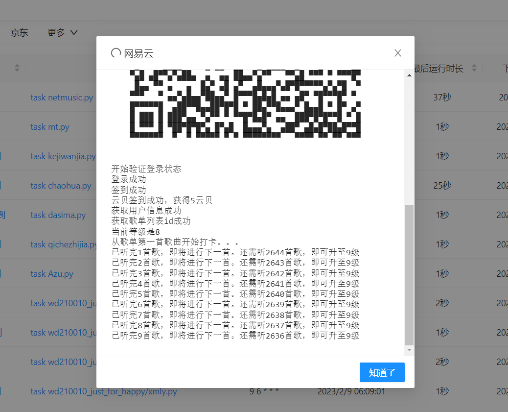

# NeteaseMusci_Upgrade
## 网易云音乐每天自动打卡，云贝中心签到，听歌三百首，🚀🚀快速升级🚀🚀

本项目主要灵感来自<a href = 'https://github.com/ZainCheung/netease-cloud'><b>网易云音乐升级全家桶</b></a>,因为该项目已经停止维护，所以就自己动手写了一个简单的。
作者水平有限，代码写的很臭😥😥😥，但是能跑🤩🤩🤩

全部代码都在放在了main.py中 <br/>

## 🍷🍷注意：由于网易云音乐使用手机号和邮箱登录增加了云盾验证，目前还无法绕过验证，故此项目采用的是<b>扫码登录</b>的方式，同时也防止你的密码泄露
## ⛔使用须知⛔
 <br/>
1.本项目基于网易云音乐API，使用前请先部署完成此项目<a href='https://github.com/Binaryify/NeteaseCloudMusicApi'><b/>NeteaseCloudMusicApi</b></a>  <br/>
2.每天请更换新的歌单id，因为同一首歌的播放次数不会被计入等级。不想每天修改的话。你可以找若干个歌单id，放到列表中进行迭代（只提供一下思路，因为作者比较懒，没写该部分😴😴😴😴） <br/>
###    代码参数解释  
<br/>
这是运行该项目所需要的配置参数
```
api = "" 
sckey = "" 
user_sl_id = ""
```
<br/>
1.api: 部署完上面的网易云音乐API项目后拿到你自己的API，填入此处  <br/>
2.SERVER酱的推送方式，不想使用的话，直接忽略即可  <br/>
3.user_sl_id：歌单id号，下面提及获取方法   <br/>
##   使用方法
<br/>
1、部署网易云音乐API,<a href='https://github.com/Binaryify/NeteaseCloudMusicApi'><b/>NeteaseCloudMusicApi</b></a>，部署完成后，拿到你自己的API地址，填入到main.py中的'''api='' '''内 <br/>
2、安装项目依赖,''' pip install -r requirements.txt''',若在运行过程中，缺少某个依赖，直接使用'''pip install'''进行安装即可<br/>
3.填写<a href = 'https://sct.ftqq.com/'>server酱</a>的sendkey，没有的话可以注册一个。不想使用的话，直接跳过<br/>
4.获取歌单id,在网易云音乐选择一个歌曲数量大于300首的歌单。歌单id获取方法为：选择歌单以链接的形式分享，链接中id=后的一串数字即为歌单id，然后填到main.py中'''user_sl_id = '' '''中。<br/>
5.运行mian.py，使用手机网易云音乐扫码即可登录。注意：如果是部署到本地，请将main.py中的代码第59行注释掉，将第60行取消注释。如果是部署在服务器上，则不用修改。解释：因为在本地运行的话就直接显示二维码图片，直接扫即可。服务器上我使用第三方库渲染出的二维码是以字符串的形式显示的，成功率不是很好，但是基本上都没问题。<br/>

效果展示：<br/>
运行前和运行后，听歌数量对比



## 部署方法
<br/>
 实现每天定时执行脚本的话，有很多种方法，可自上网找部署教程：<br/>
 1.将脚本部署在<a href="https://console.cloud.tencent.com/scf/list?rid=33&ns=default">腾讯云函数</a>上。云函数使用教程，可自行百度。（不要忘了安装requirement.txt中的依赖😛） <br/>
 2.你如果拥有自己的服务器的话，可以部署在<b><a href="https://github.com/whyour/qinglong">青龙面板</a></b>上作者在使用的工具，推荐青龙面板，比较好操作。青龙面板需要到依赖管理中的python3下面自行安装requirement.txt中的依赖<br/>
 3.在本地电脑部署，比较简单<br/>
 >下面是我在本地和青龙面板上成功运行样图
    
 


### 有问题，请提issues
